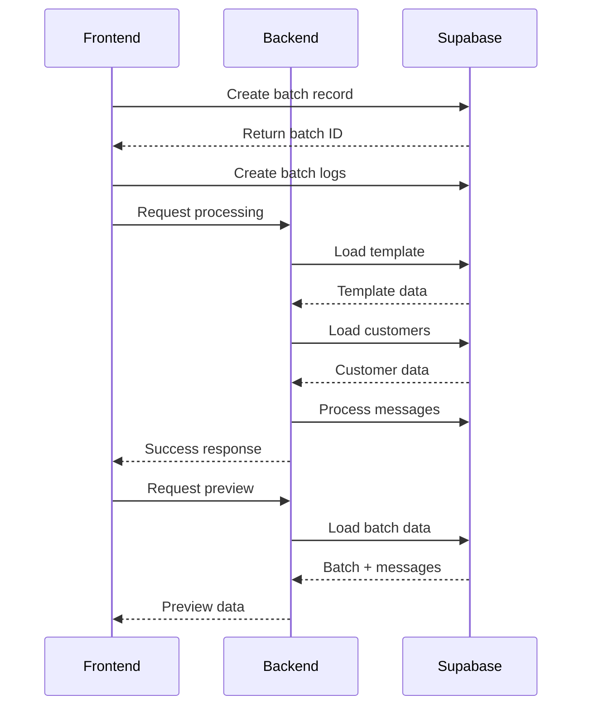

# Batch Creation and Preview Implementation

## Overview

This document outlines the implementation of an optimized batch message creation and preview system. The system uses a backend-first approach where data is loaded directly from Supabase, reducing network payload and improving performance.

## Current Progress

### Completed Tasks ✅

1. Feature Flag System
   - Created sms_feature_flags table
   - Implemented Redux-based feature flag management
   - Added auto-creation of missing flags
   - Added user targeting and percentage rollouts

2. Customer Management
   - Implemented customer data loading from Supabase
   - Added pagination support
   - Added search functionality
   - Fixed sorting by date_create
   - Added advanced filtering with proper null/empty handling:
     - String fields: includes null, empty, and non-matching values
     - Number fields: includes null and non-matching values
     - Date fields: includes null and non-matching dates with YYYY-MM-DD format
     - Boolean fields: includes null and opposite values
   - Unified filter handling between customer page and batch creation
   - Added type-safe filter conversion for Supabase queries

3. Frontend Components
   - Implemented BatchWorkspace component
   - Added step-by-step interface
   - Integrated Material-UI components
   - Added loading and error states

4. Batch Processing ✅
   - Implemented batch queue system with retry mechanism
   - Added completion verification with 30-second delay
   - Added progress tracking with JSONB fields
   - Added detailed error tracking and categorization
   - Added success rate calculation
   - Added message status tracking (pending, processing, completed, failed)

### In Progress 🚧

1. Template Selection
   - Template search implementation
   - Preview functionality
   - Template metadata display

2. Preview System
   - Real-time message preview
   - Variable substitution
   - Character count validation

### Remaining Tasks 📋

1. Analytics & Monitoring
   - Add performance metrics
   - Implement SLA monitoring
   - Create analytics dashboard
   - Add export functionality

2. Testing & Validation
   - Add unit tests for batch processing
   - Add integration tests for status updates
   - Add end-to-end tests for batch creation flow
   - Add error scenario testing

## Migration Plan

### Component Retirement

#### Backend Components to be Retired
```
src/
  ├── routes/
  │   └── batch.js           # Current batch routes
  ├── models/
  │   └── batch.js           # In-memory batch processing
  └── utils/
      ├── messageHistory.js  # Message history tracking
      └── fileCache.js       # File caching
```

#### Frontend Components to be Retired
```
frontend/src/features/batches/
  ├── components/
  │   ├── BatchCreationDialog.tsx        # Legacy dialog
  │   ├── BatchConfigurationPanel.tsx    # Legacy config
  │   └── BatchPreviewPanel.tsx          # Legacy preview
  └── hooks/
      └── useBatchOperations.ts          # Legacy operations
```

### New Component Structure

#### Backend
```
src/
  ├── routes/
  │   └── v2/
  │       └── batch.js       # New Supabase implementation
  ├── models/
  │   └── v2/
  │       ├── BatchManager.js    # New batch processing
  │       ├── BatchValidator.js  # Input validation
  │       └── BatchPreview.js    # Preview generation
  └── services/
      └── supabase/
          ├── BatchRepository.js  # Data access
          ├── TemplateRepository.js
          └── CustomerRepository.js
```

#### Frontend
```
frontend/src/features/
  ├── batches/
  │   ├── workspace/
  │   │   ├── components/
  │   │   │   ├── BatchWorkspace.tsx
  │   │   │   └── steps/
  │   │   │       ├── TemplateSelectionStep.tsx
  │   │   │       ├── CustomerConfigurationStep.tsx
  │   │   │       └── PreviewAndScheduleStep.tsx
  │   │   ├── hooks/
  │   │   │   ├── useTemplates.ts
  │   │   │   ├── useCustomers.ts
  │   │   │   └── useBatchPreview.ts
  │   │   └── types.ts
  │   └── hooks/
  │       └── useBatchPreview.ts
  └── admin/
      ├── components/
      │   ├── NotificationHistory.tsx
      │   └── BatchMetrics.tsx
      └── hooks/
          ├── useBatchMetrics.ts
          └── useBatchAlerts.ts
```

### Migration Strategy

1. Phase 1: New Implementation (2-3 weeks) ✅
   - Create new Supabase tables
   - Implement v2 backend endpoints
   - Create new frontend components
   - Add feature flag system

2. Phase 2: Core Features (1-2 weeks) ✅
   - Complete template selection
   - Finish preview system
   - Add batch processing
   - Implement error handling
   - Add advanced customer filtering
   - Unify filter handling across components

3. Phase 3: Advanced Features (2-3 weeks) 🚧
   - Implement notification search
   - Add performance monitoring
   - Add analytics dashboard
   - Add export functionality

4. Phase 4: Gradual Migration (2-3 weeks)
   - Enable for subset of users
   - Monitor performance
   - Gather feedback
   - Make improvements

5. Phase 5: Cleanup (1 week)
   - Remove old components
   - Clean up deprecated code
   - Update documentation
   - Archive old implementation

### Rollback Plan

Triggers:
- Increased error rates
- Performance degradation
- Data inconsistency
- Critical user feedback

Steps:
1. Disable feature flag
2. Revert to old endpoints
3. Restore old components
4. Analyze issues

## Architecture

### Data Flow



## Recent Updates

### Batch Processing Improvements

1. Message Queue System
   - Added concurrency control (5 messages at a time)
   - Added retry mechanism with backoff
   - Added completion verification with 30-second delay
   - Added detailed logging

2. Status Tracking
   - Added progress tracking in JSONB fields
   - Added message status transitions (pending -> processing -> completed/failed)
   - Added error categorization and sampling
   - Added success rate calculation

3. Performance Monitoring
   - Added messages per second tracking
   - Added credits used tracking
   - Added batch completion time estimation
   - Added error rate monitoring

### Next Steps

1. Customer Management Improvements
   - Add saved filter management
   - Add filter sharing between users
   - Add filter templates for common scenarios
   - Add filter import/export functionality

2. Testing & Validation
   - Add unit tests for batch processing
   - Add integration tests for status updates
   - Add error scenario testing
   - Add performance benchmarks

2. Analytics & Monitoring
   - Implement real-time monitoring dashboard
   - Add batch performance metrics
   - Add error trend analysis
   - Add cost tracking

3. Documentation & Training
   - Update API documentation
   - Create user guides
   - Document error handling procedures
   - Create troubleshooting guides
