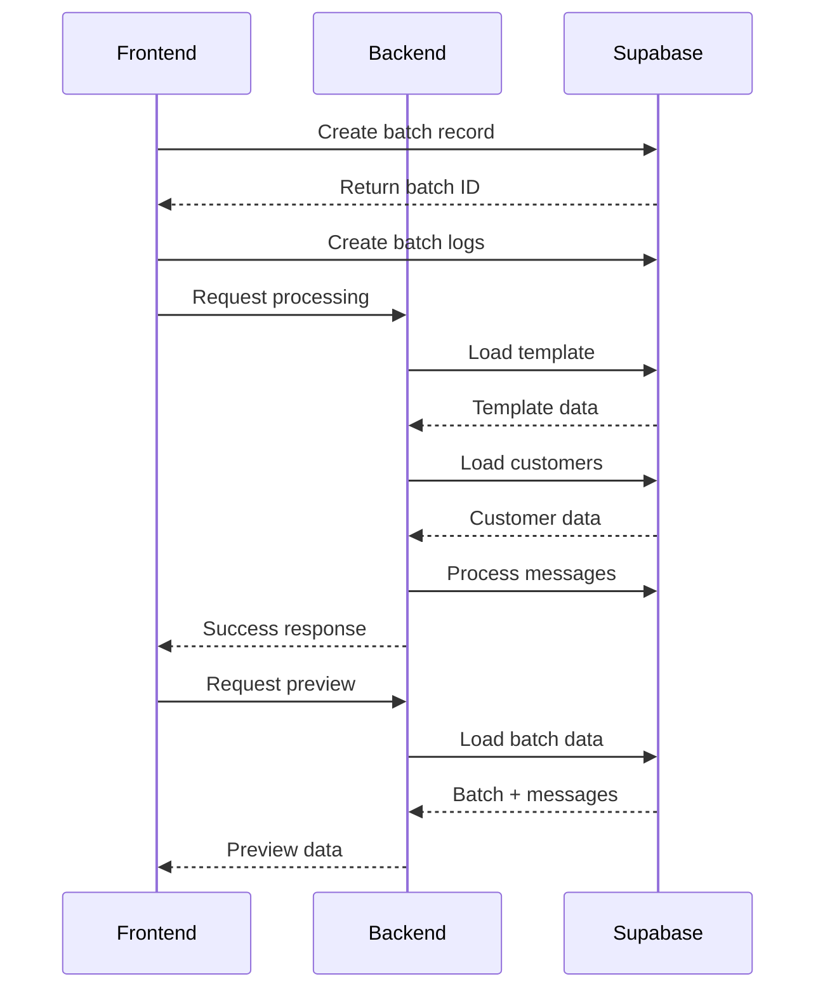

# Batch Creation and Preview Implementation

## Overview

This document outlines the implementation of an optimized batch message creation and preview system. The system uses a backend-first approach where data is loaded directly from Supabase, reducing network payload and improving performance.

## Architecture

### Data Flow



## Backend Implementation

### 1. Batch Creation Endpoint

```javascript
router.post('/batch', async (req, res) => {
  const { batchId, templateId, options } = req.body;
  
  try {
    // Load template
    const { data: template, error: templateError } = await supabase
      .from('templates')
      .select('*')
      .eq('id', templateId)
      .single();
      
    if (templateError) throw templateError;

    // Load batch logs
    const { data: logs, error: logsError } = await supabase
      .from('sms_batch_log')
      .select('*')
      .eq('batch_id', batchId);
      
    if (logsError) throw logsError;

    // Process batch
    await processBatch(template, logs, options);

    return res.json({
      success: true,
      batchId,
      summary: {
        totalRecipients: logs.length,
        scheduledFor: options.scheduleTime
      }
    });
  } catch (error) {
    console.error('Batch creation error:', error);
    return res.status(500).json({
      success: false,
      error: error.message
    });
  }
});
```

### 2. Preview Endpoint

```javascript
router.get('/batch/:batchId/preview', async (req, res) => {
  const { batchId } = req.params;
  const { previewCount = 5 } = req.query;

  try {
    // Load batch with template
    const { data: batch, error: batchError } = await supabase
      .from('sms_batches')
      .select(`
        *,
        template:templates(*)
      `)
      .eq('id', batchId)
      .single();
      
    if (batchError) throw batchError;

    // Load sample messages
    const { data: messages, error: messagesError } = await supabase
      .from('sms_batch_log')
      .select('*')
      .eq('batch_id', batchId)
      .limit(previewCount);
      
    if (messagesError) throw messagesError;

    return res.json({
      success: true,
      data: {
        template: batch.template,
        messages: messages.map(msg => ({
          phoneNumber: msg.targets,
          content: msg.message,
          variables: msg.variables
        }))
      }
    });
  } catch (error) {
    console.error('Preview error:', error);
    return res.status(500).json({
      success: false,
      error: error.message
    });
  }
});
```

## Frontend Implementation

### 1. Batch Creation Flow

```typescript
// batchThunks.ts
export const createBatch = createAsyncThunk(
  'batches/createBatch',
  async (data: BatchCreationState) => {
    try {
      // Create batch record
      const { data: batch, error: batchError } = await supabase
        .from('sms_batches')
        .insert({
          name: data.name,
          template_id: data.template.id,
          status: 'pending',
          total_recipients: data.customers.length,
          scheduled_for: data.scheduledFor
        })
        .select()
        .single();

      if (batchError) throw batchError;

      // Create batch logs
      const { error: logsError } = await supabase
        .from('sms_batch_log')
        .insert(
          data.customers.map(customer => ({
            batch_id: batch.id,
            targets: customer.phone,
            variables: extractRequiredVariables(customer)
          }))
        );

      if (logsError) throw logsError;

      // Request processing
      await api.post('/api/batch', {
        batchId: batch.id,
        templateId: data.template.id,
        options: {
          scheduleTime: data.scheduledFor
        }
      });

      return batch;
    } catch (error) {
      throw new Error(`Batch creation failed: ${error.message}`);
    }
  }
);
```

### 2. Preview Hook

```typescript
// hooks/useBatchPreview.ts
export const useBatchPreview = (batchId: string) => {
  const [state, setState] = useState<PreviewState>({
    previews: [],
    currentIndex: 0,
    loading: false,
    error: null
  });

  const loadPreviews = useCallback(async () => {
    setState(prev => ({ ...prev, loading: true }));
    try {
      const response = await api.get(`/api/batch/${batchId}/preview`);
      setState(prev => ({
        ...prev,
        previews: response.data.data.messages,
        loading: false
      }));
    } catch (error) {
      setState(prev => ({
        ...prev,
        error: error.message,
        loading: false
      }));
    }
  }, [batchId]);

  const nextPreview = useCallback(() => {
    setState(prev => ({
      ...prev,
      currentIndex: (prev.currentIndex + 1) % prev.previews.length
    }));
  }, []);

  const previousPreview = useCallback(() => {
    setState(prev => ({
      ...prev,
      currentIndex: prev.currentIndex === 0 
        ? prev.previews.length - 1 
        : prev.currentIndex - 1
    }));
  }, []);

  return {
    ...state,
    loadPreviews,
    nextPreview,
    previousPreview
  };
};
```

### 3. Preview Component

```typescript
// components/BatchPreviewDialog.tsx
export const BatchPreviewDialog: React.FC<BatchPreviewDialogProps> = ({
  batchId,
  open,
  onClose
}) => {
  const preview = useBatchPreview(batchId);
  
  useEffect(() => {
    if (open && batchId) {
      preview.loadPreviews();
    }
  }, [open, batchId]);

  return (
    <Dialog 
      open={open} 
      onClose={onClose}
      maxWidth="md"
      fullWidth
    >
      <DialogTitle>Message Preview</DialogTitle>
      <DialogContent>
        {preview.loading ? (
          <CircularProgress />
        ) : preview.error ? (
          <Alert severity="error">{preview.error}</Alert>
        ) : (
          <Stack spacing={2}>
            <Typography>
              Preview {preview.currentIndex + 1} of {preview.previews.length}
            </Typography>
            
            <Paper sx={{ p: 2 }}>
              <PreviewContent 
                message={preview.previews[preview.currentIndex]} 
              />
            </Paper>

            <Box sx={{ display: 'flex', justifyContent: 'space-between' }}>
              <Button 
                onClick={preview.previousPreview}
                startIcon={<ArrowBackIcon />}
              >
                Previous
              </Button>
              <Button 
                onClick={preview.nextPreview}
                endIcon={<ArrowForwardIcon />}
              >
                Next
              </Button>
            </Box>
          </Stack>
        )}
      </DialogContent>
    </Dialog>
  );
};
```

## Error Handling

### Backend Errors

1. Template Loading Errors:
   - Missing template
   - Invalid template format
   - Template access permission issues

2. Customer Data Errors:
   - Missing required fields
   - Invalid phone numbers
   - Duplicate entries

3. Processing Errors:
   - Rate limiting
   - Network issues
   - Database connection problems

### Frontend Errors

1. Batch Creation Errors:
   - Validation errors
   - Network errors
   - Permission errors

2. Preview Loading Errors:
   - Missing batch data
   - Network timeouts
   - Invalid preview data

## Performance Considerations

1. Database Optimization:
   - Batch inserts for logs
   - Indexed queries
   - Efficient joins

2. Network Optimization:
   - Minimized payload size
   - Compressed responses
   - Cached template data

3. Frontend Optimization:
   - Debounced preview loading
   - Pagination for large batches
   - Memoized components

## Security Considerations

1. Data Access:
   - Validate user permissions
   - Sanitize template variables
   - Validate phone numbers

2. API Security:
   - Rate limiting
   - Request validation
   - Error message sanitization

## Testing Strategy

1. Unit Tests:
   - Template processing
   - Variable substitution
   - Error handling

2. Integration Tests:
   - Batch creation flow
   - Preview loading
   - Error scenarios

3. End-to-End Tests:
   - Complete batch creation
   - Preview functionality
   - Error recovery

## Monitoring and Logging

1. Performance Metrics:
   - Creation time
   - Preview loading time
   - Error rates

2. Error Tracking:
   - Error categorization
   - Stack traces
   - User context

3. Usage Analytics:
   - Batch sizes
   - Template usage
   - Preview engagement
